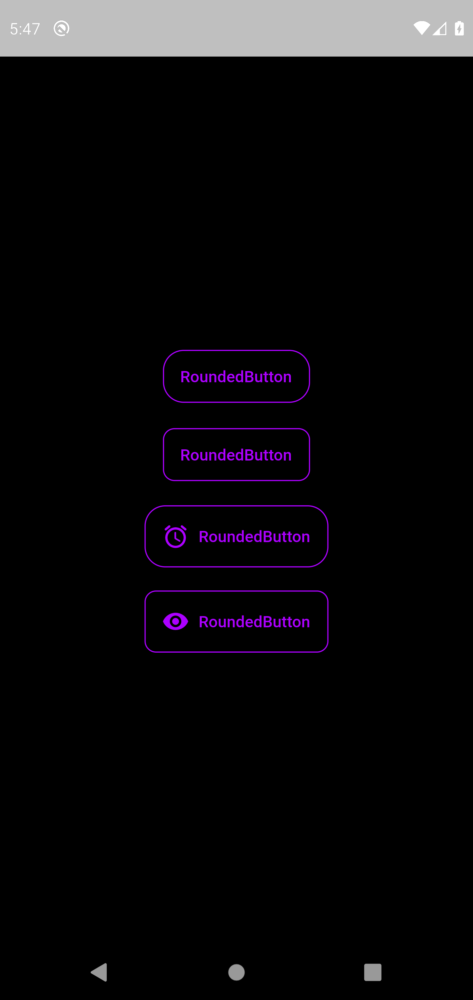

# Rounded Button

```Easy to use Pre-made Rounded Buttons with advanced features for Flutter.```

Check the example project.



## Getting Started

First you have to add the package dependency in ```pubspec.yml```

    rounded_button: ^latest
Get the version from [pub.dev](https://pub.dev/packages/rounded_button)

The Button is a stateless widget. So you can use it anywhere you can use stateless widget.

### To use ```Rounded Button``` without icon

In your code you can use the rounded button without icon like this.

    RoundedButton(
        primaryColor: Color(0xFFAC00FF),
        text: 'RoundedButton',
        onPressed: () {},
    ),

### To use ```Rounded Button``` with icon

In your code you can use the rounded button with icon like this.

    RoundedButton(
        primaryColor: primaryColor,
        text: 'RoundedButton',
        onPressed: () {},
        icon: Icon(
            Icons.access_alarm_rounded,
        ),
    ),

Check the optional settings for advanced use.

## Optional Params

- Added optional settings
  - icon,
  - borderColor,
  - textColor,
  - splashColor,
  - backgroundColor,
  - elevation = 3.5,
  - textStyle,
  - borderRadius,
  - padding = const EdgeInsets.all(15.0),

## Other Projects

[TransitionX](https://pub.dev/packages/transition_x), [Rounded Button](https://pub.dev/packages/rounded_button)
